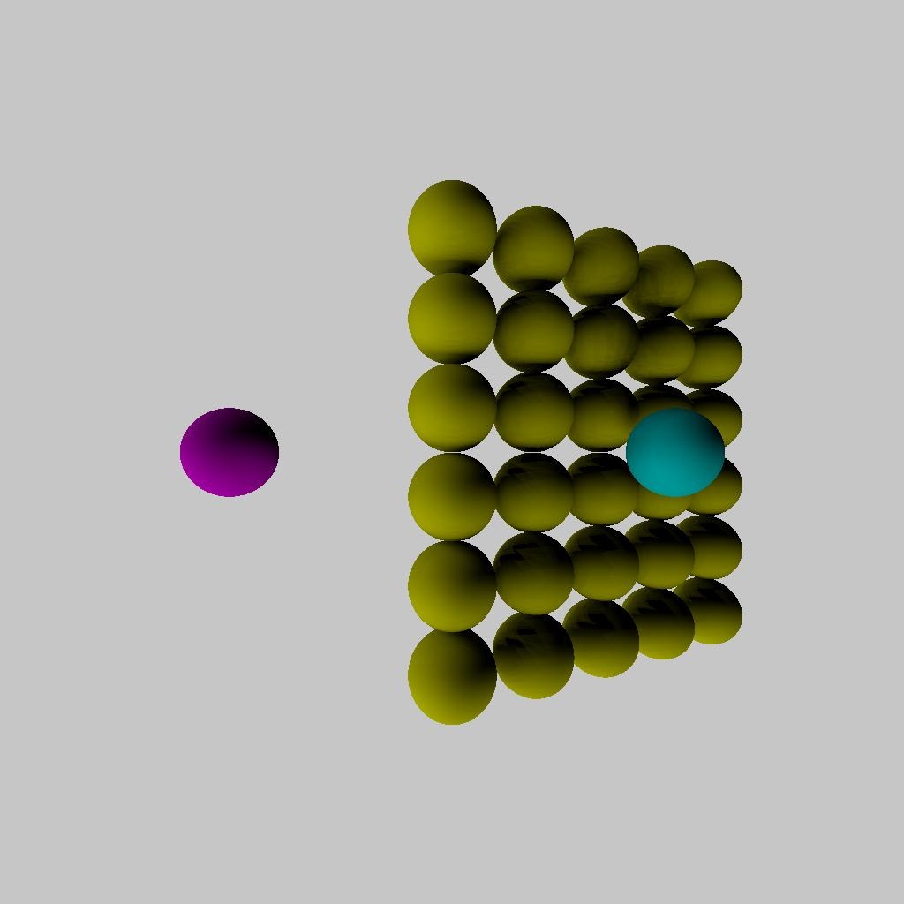

# Multi-threaded Ray Tracing

A ray-tracing algorithm that performs direct illumination of spheres.

# Task:

## Your code will take two text files as input, describing a (a) list of spheres and a (b) list of lights.
## Your code will output the ray-traced image as a Targa file (source code is provided to save this file format).
## Parallelize the code using the C++ std::thread library.

Finally the tga file could be converted into jpg for visualization using a python code.

# Image

